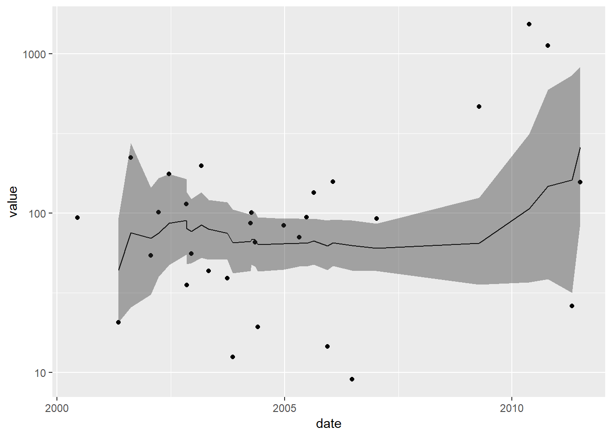

<!-- README.md is generated from README.Rmd. Please edit that file -->

# tbrf

The goal of tbrf is to provide time-window based rolling statistical
functions. The package differs from other rolling statistic packages
because the intended use is for irregular measured data.

An example use case is water quality data that is measured at irregular
time intervals. Regulatory compliance is often based on a statistical
average measure or exceedance probability applied to all samples
collected in the previous 7-years.

tbrf identifies the previous n measurements within the specified time
window, applies the function, and outputs a varaible with the result of
the rolling statistical measure.

## Installation

tbrf is still under development and can be installed from github with:

``` r
devtools::install.github("mps9506/tbrf")
```

## Examples

### Rolling Geometric Mean

``` r
library(tbrf)
library(dplyr)
library(ggplot2)

## Generate sample data
set.seed(100)
df <- data.frame(
  date = sample(seq(as.Date('2000-01-01'), 
                    as.Date('2015/12/30'), by = "day"), 50),
  value = rexp(50, 1/100)
)

head(df)
#>         date     value
#> 1 2004-12-03 101.52666
#> 2 2004-02-14 197.57269
#> 3 2008-10-31 157.68313
#> 4 2000-11-25  70.67098
#> 5 2007-06-28 222.59788
#> 6 2007-09-25 114.16835

## apply the geomean to each row
df <- tbr_gmean(df, x = value, tcolumn = date,
                unit = "years", n = 5, conf.level = 0.95)
df
#> # A tibble: 50 x 5
#>    date         value  mean    lwr.ci    upr.ci
#>    <date>       <dbl> <dbl>     <dbl>     <dbl>
#>  1 2000-11-25  70.7    70.7 NaN            NaN 
#>  2 2002-01-26 413.    171.    0.00230 12682074.
#>  3 2002-09-20 134.    158.   17.1         1451.
#>  4 2002-09-24 309.    186.   51.9          669.
#>  5 2002-11-13 128.    173.   71.1          421.
#>  6 2003-04-07 111.    161.   79.9          323.
#>  7 2003-04-18   1.36   81.2  14.0          472.
#>  8 2004-02-14 198.     90.8  20.3          405.
#>  9 2004-06-02   0.800  53.7   9.16         314.
#> 10 2004-06-22  43.3    52.5  11.1          248.
#> # ... with 40 more rows

## in a tidy pipeline
set.seed(100)
df <- data.frame(
  date = sample(seq(as.Date('2000-01-01'), 
                    as.Date('2015/12/30'), by = "day"), 50),
  value = rexp(50, 1/100)
)

df <- df %>%
  tbr_gmean(x = value, tcolumn = date, unit = "years",
            n = 5, conf.level = 0.95)
df
#> # A tibble: 50 x 5
#>    date         value  mean    lwr.ci    upr.ci
#>    <date>       <dbl> <dbl>     <dbl>     <dbl>
#>  1 2000-11-25  70.7    70.7 NaN            NaN 
#>  2 2002-01-26 413.    171.    0.00230 12682074.
#>  3 2002-09-20 134.    158.   17.1         1451.
#>  4 2002-09-24 309.    186.   51.9          669.
#>  5 2002-11-13 128.    173.   71.1          421.
#>  6 2003-04-07 111.    161.   79.9          323.
#>  7 2003-04-18   1.36   81.2  14.0          472.
#>  8 2004-02-14 198.     90.8  20.3          405.
#>  9 2004-06-02   0.800  53.7   9.16         314.
#> 10 2004-06-22  43.3    52.5  11.1          248.
#> # ... with 40 more rows

ggplot(df) +
  geom_point(aes(date, value)) +
  geom_line(aes(date, mean)) +
  geom_ribbon(aes(x = date, ymin = lwr.ci, ymax = upr.ci), alpha = 0.4) +
  scale_y_log10()
```


