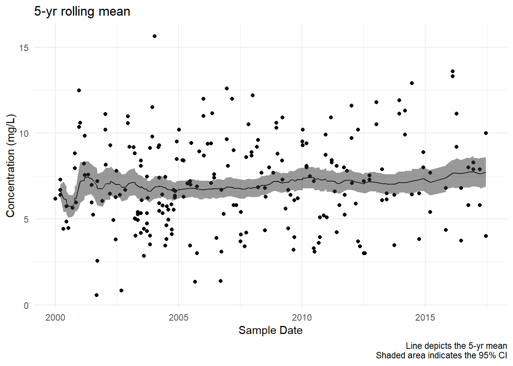

<!-- README.md is generated from README.Rmd. Please edit that file -->

[](https://travis-ci.org/mps9506/tbrf)

# tbrf

The goal of tbrf is to provide time-window based rolling statistical
functions. The package differs from other rolling statistic packages
because the intended use is for irregular measured data.

An example use case is water quality data that is measured at irregular
time intervals. Regulatory compliance is often based on a statistical
average measure or exceedance probability applied to all samples
collected in the previous 7-years.

tbrf identifies the previous n measurements within the specified time
window, applies the function, and outputs a varaible with the result of
the rolling statistical measure.

## Installation

tbrf is still under active development (do not expect stable behavior)
and can be installed from github with:

``` r
devtools::install.github("mps9506/tbrf")
```

## Examples

tbrf includes built-in functions to calculate binomial probability
(`tbr_binom`), geometric mean (`tbr_gmean`), mean (`tbr_mean`), median
(`tbr_median`), standard deviation (`tbr_sd`), and sum (`tbr_sum`).

A generic function (`tbr_misc`) is provided for users to apply other
functions that accept a vector of numeric values as an argument.

``` r
library(tbrf)
library(dplyr)
library(ggplot2)

# Some sample data
df <- data_frame(date = sample(seq(as.Date('2000-01-01'),
                                   as.Date('2005-12-30'), by = "day"), 25)) %>%
  bind_rows(data.frame(date = sample(seq(as.Date('2009-01-01'),
                                         as.Date('2011-12-30'), by = "day"), 25))) %>%
  arrange(date) %>%
  mutate(value = 1:50)

# Use length function in tbr_misc to calculate n samples used in the rolling function
df <- df %>%
  tbr_misc(x = value, tcolumn = date, unit = "years", n = 5, func = length)
df
## # A tibble: 50 x 5
##    date       value results min_date   max_date  
##    <date>     <int>   <int> <date>     <date>    
##  1 2000-04-15     1       1 2000-04-15 2000-04-15
##  2 2000-06-08     2       2 2000-04-15 2000-06-08
##  3 2000-06-21     3       3 2000-04-15 2000-06-21
##  4 2000-07-25     4       4 2000-04-15 2000-07-25
##  5 2000-11-20     5       5 2000-04-15 2000-11-20
##  6 2001-02-23     6       6 2000-04-15 2001-02-23
##  7 2001-06-06     7       7 2000-04-15 2001-06-06
##  8 2001-11-25     8       8 2000-04-15 2001-11-25
##  9 2002-06-13     9       9 2000-04-15 2002-06-13
## 10 2002-07-15    10      10 2000-04-15 2002-07-15
## # ... with 40 more rows

ggplot(df) +
  geom_point(aes(date, value)) +
  geom_errorbarh(aes(xmin = min_date, xmax = max_date, 
                     y = value, color = results)) +
  scale_color_distiller(type = "seq", palette = "OrRd", 
                        direction = 1) +
  guides(color = guide_colorbar(title = "Number of samples")) +
  theme_minimal() +
  theme(legend.position = "bottom") +
  labs(x = "Sample Date", y = "Sample Value",
       title = "Window length and n used by tbrf",
       caption = "Lines depict time window used in the function\nColors indicate number of samples in the time window")
```


``` r
data("Dissolved_Oxygen")

df <- Dissolved_Oxygen %>%
  tbr_mean(x = Average_DO, tcolumn = Date, unit = "years", n = 5)

df
## # A tibble: 236 x 9
##    Station_ID Date       Param_Code Param_Desc     Average_DO Min_DO  mean
##         <int> <date>     <chr>      <chr>               <dbl>  <dbl> <dbl>
##  1      12515 2000-01-03 00300      OXYGEN, DISSO~       6.19   6.19 NA   
##  2      12515 2000-03-14 00300      OXYGEN, DISSO~       6.7    6.7   6.73
##  3      12517 2000-03-14 00300      OXYGEN, DISSO~       7.3    7.3   6.73
##  4      12515 2000-03-16 00300      OXYGEN, DISSO~       6.41   6.41  6.65
##  5      12515 2000-05-03 00300      OXYGEN, DISSO~       4.42   4.42  6.20
##  6      12517 2000-06-14 00300      OXYGEN, DISSO~       5.74   5.74  6.13
##  7      12515 2000-06-15 00300      OXYGEN, DISSO~       4.86   4.86  5.95
##  8      12515 2000-07-11 00300      OXYGEN, DISSO~       4.48   4.48  5.76
##  9      12515 2000-09-12 00300      OXYGEN, DISSO~       5.64   5.64  5.75
## 10      12517 2000-10-17 00300      OXYGEN, DISSO~       7.96   7.96  5.97
## # ... with 226 more rows, and 2 more variables: lwr.ci <dbl>, upr.ci <dbl>

ggplot(df) +
  geom_point(aes(Date, Average_DO)) +
  geom_line(aes(Date, mean)) +
  geom_ribbon(aes(Date, ymin = lwr.ci, ymax = upr.ci), alpha = 0.5) +
  theme_minimal() +
   labs(x = "Sample Date", y = "Concentration (mg/L)",
       title = "5-yr rolling mean",
       caption = "Line depicts the 5-yr mean\nShaded area indicates the 95% CI")
## Warning: Removed 1 rows containing missing values (geom_path).
```



## Contributing

Please note that this project is released with a [Contributor Code of
Conduct](CODE_OF_CONDUCT.md). By participating in this project you agree
to abide by its terms.

### Test Results

``` r
library(tbrf)

date()
## [1] "Wed Jul 25 08:12:54 2018"

devtools::test()
## v | OK F W S | Context
## 
/ |  0       | core functions return expected structures
- |  1       | core functions return expected structures
\ |  2       | core functions return expected structures
| |  3       | core functions return expected structures
/ |  4       | core functions return expected structures
- |  5       | core functions return expected structures
\ |  6       | core functions return expected structures
v |  6       | core functions return expected structures [3.7 s]
## 
/ |  0       | core functions return expected errors and messages
- |  1       | core functions return expected errors and messages
\ |  2       | core functions return expected errors and messages
| |  3       | core functions return expected errors and messages
/ |  4       | core functions return expected errors and messages
- |  5       | core functions return expected errors and messages
\ |  6       | core functions return expected errors and messages
v |  6       | core functions return expected errors and messages
## 
## == Results ==========================================================================================
## Duration: 3.7 s
## 
## OK:       12
## Failed:   0
## Warnings: 0
## Skipped:  0
```
