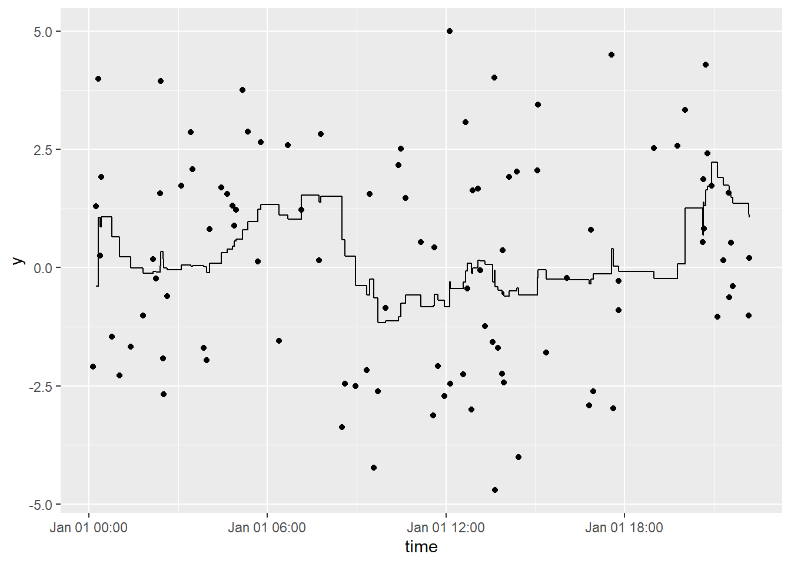

<!-- README.md is generated from README.Rmd. Please edit that file -->

# tbrf

<!-- badges: start -->

<!-- badges: end -->

tbrf is retired. I will maintain the package to ensure it remains on
CRAN but do not expect additional functionality or improvements. I
highly recommend [runner](https://gogonzo.github.io/runner/) for the
same functionality but faster!

The goal of tbrf is to provide time-window based rolling statistical
functions. The package differs from other rolling statistic packages
because the intended use is for irregular measured data. Although tbrf
can be used to apply statistical functions to regularly sampled data,
[`zoo`](https://CRAN.R-project.org/package=zoo),
[`RcppRoll`](https://cran.r-project.org/package=RcppRoll), and other
packages provide fast, efficient, and rich implementations of
rolling/windowed functions.

An appropriate example case is water quality data that is measured at
irregular time intervals. Regulatory compliance is often based on a
statistical average measure or exceedance probability applied to all
samples collected in the previous 7-years. tbrf can be used to display
regulatory status at any sample point.

tbrf identifies the previous n measurements within the specified time
window, applies the function, and outputs a variable with the result of
the rolling statistical measure.

## Installation

tbrf is available on CRAN:

    install.packages("tbrf")

The development version is maintained on github and can be installed as:

    install.packages(remotes)
    remotes::install_github("mps9506/tbrf")

## Available Functions

-   `tbr_binom`: Rolling binomial probability with confidence intervals.

-   `tbr_gmean`: Rolling geometric mean with confidence intervals.

-   `tbr_mean`: Rolling mean with confidence intervals.

-   `tbr_median`: Rolling median with confidence intervals.

-   `tbr_misc`: Accepts user specified function.

-   `tbr_sd`: Rolling standard deviation.

-   `tbr_sum`: Rolling sum.

## Usage

See:

<https://mps9506.github.io/tbrf/>

## Example

Plot a rolling 1-hour mean:

    library(tbrf)
    library(dplyr)
    library(ggplot2)
    library(ggalt)

    y = 3 * sin(2 * seq(from = 0, to = 4*pi, length.out = 100)) + rnorm(100)
    time = sample(seq(as.POSIXct(strptime("2017-01-01 00:01:00", "%Y-%m-%d %H:%M:%S")),
                      as.POSIXct(strptime("2017-01-01 23:00:00", "%Y-%m-%d %H:%M:%S")),
                      by = "min"), 100)

    df <- tibble(y, time)

    df %>%
      tbr_mean(y, time, "hours", n = 1) %>%
      ggplot() +
      geom_point(aes(time, y)) +
      geom_step(aes(time, mean))

Plot a rolling 3-hour mean:

    df %>%
      tbr_mean(y, time, "hours", n = 3) %>%
      ggplot() +
      geom_point(aes(time, y)) +
      geom_step(aes(time, mean))

## Contributing

Please note that this project is released with a [Contributor Code of
Conduct](https://github.com/mps9506/tbrf/blob/master/CODE_OF_CONDUCT.md).
By participating in this project you agree to abide by its terms.

## License

tbrf code is released under GPL-3 | LICENSE.md

`binom_ci()` is an implementation of code licensed under GPL (&gt;=2) by
Frank Harrell’s [`Hmisc`](https://github.com/harrelfe/Hmisc) package.

If you can cite the use of this software, please use `citation("tbrf")`

## Test Results

    library(tbrf)

    date()
    ## [1] "Tue Apr  1 14:02:26 2025"

    devtools::test()
    ## ✔ | F W  S  OK | Context
    ## 
    ## ⠏ |          0 | expectedClass                                                  
    ## ⠏ |          0 | core functions work in piped workflow                          
    ## ⠸ |   1      3 | core functions work in piped workflow                          
    ## ✔ |   3      6 | core functions work in piped workflow
    ## ────────────────────────────────────────────────────────────────────────────────
    ## Warning ('test-expectedClass.R:10:3'): tbr_binom returns tbl_df in tidy chain
    ## Use of .data in tidyselect expressions was deprecated in tidyselect 1.2.0.
    ## ℹ Please use `"temp"` instead of `.data$temp`
    ## Backtrace:
    ##      ▆
    ##   1. ├─testthat::expect_s3_class(...) at test-expectedClass.R:10:3
    ##   2. │ └─testthat::quasi_label(enquo(object), arg = "object")
    ##   3. │   └─rlang::eval_bare(expr, quo_get_env(quo))
    ##   4. ├─df %>% ...
    ##   5. ├─tbrf::tbr_binom(...)
    ##   6. │ └─... %>% tidyr::unnest(.data$temp) at tbrf/R/tbr_binom.R:38:3
    ##   7. ├─tidyr::unnest(., .data$temp)
    ##   8. └─tidyr:::unnest.data.frame(., .data$temp)
    ##   9.   └─tidyselect::eval_select(expr = enquo(cols), data = data, allow_rename = FALSE)
    ##  10.     └─tidyselect:::eval_select_impl(...)
    ##  11.       ├─tidyselect:::with_subscript_errors(...)
    ##  12.       │ └─base::withCallingHandlers(...)
    ##  13.       └─tidyselect:::vars_select_eval(...)
    ##  14.         └─tidyselect:::walk_data_tree(expr, data_mask, context_mask)
    ##  15.           └─tidyselect:::expr_kind(expr, context_mask, error_call)
    ##  16.             └─tidyselect:::call_kind(expr, context_mask, error_call)
    ## 
    ## Warning ('test-expectedClass.R:44:3'): tbr_sd returns tbl_df in tidy chain
    ## Use of .data in tidyselect expressions was deprecated in tidyselect 1.2.0.
    ## ℹ Please use `"sd"` instead of `.data$sd`
    ## Backtrace:
    ##      ▆
    ##   1. ├─testthat::expect_s3_class(...) at test-expectedClass.R:44:3
    ##   2. │ └─testthat::quasi_label(enquo(object), arg = "object")
    ##   3. │   └─rlang::eval_bare(expr, quo_get_env(quo))
    ##   4. ├─df %>% tbr_sd(x = value, tcolumn = date, unit = "years", n = 5)
    ##   5. ├─tbrf::tbr_sd(., x = value, tcolumn = date, unit = "years", n = 5)
    ##   6. │ └─... %>% tidyr::unnest(.data$sd) at tbrf/R/tbr_sd.R:21:3
    ##   7. ├─tidyr::unnest(., .data$sd)
    ##   8. └─tidyr:::unnest.data.frame(., .data$sd)
    ##   9.   └─tidyselect::eval_select(expr = enquo(cols), data = data, allow_rename = FALSE)
    ##  10.     └─tidyselect:::eval_select_impl(...)
    ##  11.       ├─tidyselect:::with_subscript_errors(...)
    ##  12.       │ └─base::withCallingHandlers(...)
    ##  13.       └─tidyselect:::vars_select_eval(...)
    ##  14.         └─tidyselect:::walk_data_tree(expr, data_mask, context_mask)
    ##  15.           └─tidyselect:::expr_kind(expr, context_mask, error_call)
    ##  16.             └─tidyselect:::call_kind(expr, context_mask, error_call)
    ## 
    ## Warning ('test-expectedClass.R:53:3'): tbr_sum returns tbl_df in tidy chain
    ## Use of .data in tidyselect expressions was deprecated in tidyselect 1.2.0.
    ## ℹ Please use `"sum"` instead of `.data$sum`
    ## Backtrace:
    ##      ▆
    ##   1. ├─testthat::expect_s3_class(...) at test-expectedClass.R:53:3
    ##   2. │ └─testthat::quasi_label(enquo(object), arg = "object")
    ##   3. │   └─rlang::eval_bare(expr, quo_get_env(quo))
    ##   4. ├─df %>% ...
    ##   5. ├─tbrf::tbr_sum(., x = value, tcolumn = date, unit = "years", n = 5)
    ##   6. │ └─... %>% tidyr::unnest(.data$sum) at tbrf/R/tbr_sum.R:25:3
    ##   7. ├─tidyr::unnest(., .data$sum)
    ##   8. └─tidyr:::unnest.data.frame(., .data$sum)
    ##   9.   └─tidyselect::eval_select(expr = enquo(cols), data = data, allow_rename = FALSE)
    ##  10.     └─tidyselect:::eval_select_impl(...)
    ##  11.       ├─tidyselect:::with_subscript_errors(...)
    ##  12.       │ └─base::withCallingHandlers(...)
    ##  13.       └─tidyselect:::vars_select_eval(...)
    ##  14.         └─tidyselect:::walk_data_tree(expr, data_mask, context_mask)
    ##  15.           └─tidyselect:::expr_kind(expr, context_mask, error_call)
    ##  16.             └─tidyselect:::call_kind(expr, context_mask, error_call)
    ## ────────────────────────────────────────────────────────────────────────────────
    ## 
    ## ⠏ |          0 | expectedMessages                                               
    ## ⠏ |          0 | core functions return expected errors and messages             
    ## ⠹ |          3 | core functions return expected errors and messages             
    ## ⠴ |          6 | core functions return expected errors and messages             
    ## ✔ |          7 | core functions return expected errors and messages
    ## 
    ## ⠏ |          0 | expectedValues                                                 
    ## ⠏ |          0 | core functions return expected structures and values           
    ## ⠹ |          3 | core functions return expected structures and values           
    ## ⠼ |          5 | core functions return expected structures and values           
    ## ⠴ |          6 | core functions return expected structures and values           
    ## ✔ |          6 | core functions return expected structures and values
    ## 
    ## ⠏ |          0 | internalStatsFunctions                                         
    ## ⠏ |          0 | internal statistical functions return expected values          
    ## ⠼ |          5 | internal statistical functions return expected values          
    ## ✔ |         17 | internal statistical functions return expected values
    ## 
    ## ══ Results ═════════════════════════════════════════════════════════════════════
    ## Duration: 1.5 s
    ## 
    ## [ FAIL 0 | WARN 3 | SKIP 0 | PASS 36 ]
