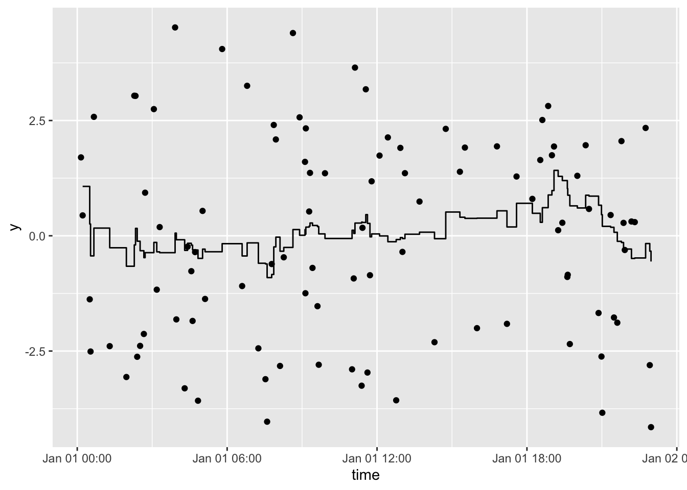

<!-- README.md is generated from README.Rmd. Please edit that file -->

# tbrf

[](https://CRAN.R-project.org/package=tbrf)
[](https://travis-ci.org/mps9506/tbrf)
[](https://ci.appveyor.com/project/mps9506/tbrf)
[](https://codecov.io/github/mps9506/tbrf?branch=master)

[](https://www.gnu.org/licenses/gpl-3.0)

The goal of tbrf is to provide time-window based rolling statistical
functions. The package differs from other rolling statistic packages
because the intended use is for irregular measured data. Althogh tbrf
can be used to apply statistical functions to regularly sampled data,
[`zoo`](https://CRAN.R-project.org/package=zoo),
[`RcppRoll`](https://cran.r-project.org/package=RcppRoll), and other
packages provide fast, efficient, and rich implementations of
rolling/windowed functions.

An appropriate example case is water quality data that is measured at
irregular time intervals. Regulatory compliance is often based on a
statistical average measure or exceedance probability applied to all
samples collected in the previous 7-years. tbrf can be used to display
regulatory status at any sample point.

tbrf identifies the previous n measurements within the specified time
window, applies the function, and outputs a variable with the result of
the rolling statistical measure.

## Installation

tbrf is available on CRAN:

``` r
install.packages("tbrf")
```

The development version is maintained on github and can be installed as:

``` r
devtools::install.github("mps9506/tbrf")
```

## Available Functions

  - `tbr_binom`: Rolling binomal probability with confidence intervals.

  - `tbr_gmean`: Rolling geometric mean with confidence intervals.

  - `tbr_mean`: Rolling mean with confidence intervals.

  - `tbr_median`: Rolling median with confidence intervals.

  - `tbr_misc`: Accepts user specified function.

  - `tbr_sd`: Rolling standard deviation.

  - `tbr_sum`: Rolling sum.

## Usage

See:

<https://mps9506.github.io/tbrf/>

## Example

Plot a rolling 1-hour mean:

``` r
library(tbrf)
library(dplyr)
library(ggplot2)
library(ggalt)

y = 3 * sin(2 * seq(from = 0, to = 4*pi, length.out = 100)) + rnorm(100)
time = sample(seq(as.POSIXct(strptime("2017-01-01 00:01:00", "%Y-%m-%d %H:%M:%S")),
                  as.POSIXct(strptime("2017-01-01 23:00:00", "%Y-%m-%d %H:%M:%S")),
                  by = "min"), 100)

df <- data_frame(y, time)

df %>%
  tbr_mean(y, time, "hours", n = 1) %>%
  ggplot() +
  geom_point(aes(time, y)) +
  geom_step(aes(time, mean))
```


Plot a rolling 3-hour mean:

``` r
df %>%
  tbr_mean(y, time, "hours", n = 3) %>%
  ggplot() +
  geom_point(aes(time, y)) +
  geom_step(aes(time, mean))
```



## Contributing

Please note that this project is released with a [Contributor Code of
Conduct](CODE_OF_CONDUCT.md). By participating in this project you agree
to abide by its terms.

## License

tbrf code is released under GPL-3 | LICENSE.md

`binom_ci()` is an implementation of code licensed under GPL (\>=2) by
Frank Harrell’s [`Hmisc`](https://github.com/harrelfe/Hmisc) package.

## Test Results

``` r
library(tbrf)

date()
## [1] "Thu Nov 14 16:47:47 2019"

devtools::test()
## v |  OK F W S | Context
## 
/ |   0       | core functions work in piped workflow
- |   1       | core functions work in piped workflow
| |   3       | core functions work in piped workflow
/ |   4       | core functions work in piped workflow
\ |   6       | core functions work in piped workflow
v |   6       | core functions work in piped workflow [0.8 s]
## 
/ |   0       | core functions return expected errors and messages
| |   7       | core functions return expected errors and messages
v |   7       | core functions return expected errors and messages [0.1 s]
## 
/ |   0       | core functions return expected structures and values
- |   1       | core functions return expected structures and values
\ |   2       | core functions return expected structures and values
| |   3       | core functions return expected structures and values
- |   5       | core functions return expected structures and values
\ |   6       | core functions return expected structures and values
v |   6       | core functions return expected structures and values [2.7 s]
## 
/ |   0       | internal statistical functions return expected values
- |   1       | internal statistical functions return expected values
\ |   2       | internal statistical functions return expected values
| |   3       | internal statistical functions return expected values
- |   5       | internal statistical functions return expected values
v |  11       | internal statistical functions return expected values [1.1 s]
## 
## == Results =============================================================================
## Duration: 4.7 s
## 
## OK:       30
## Failed:   0
## Warnings: 0
## Skipped:  0
```
